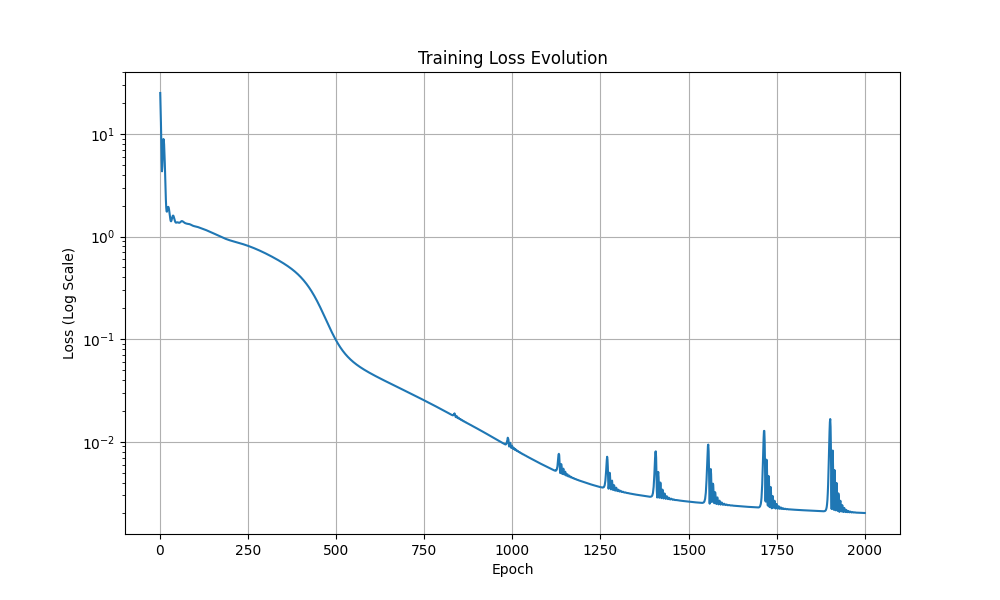
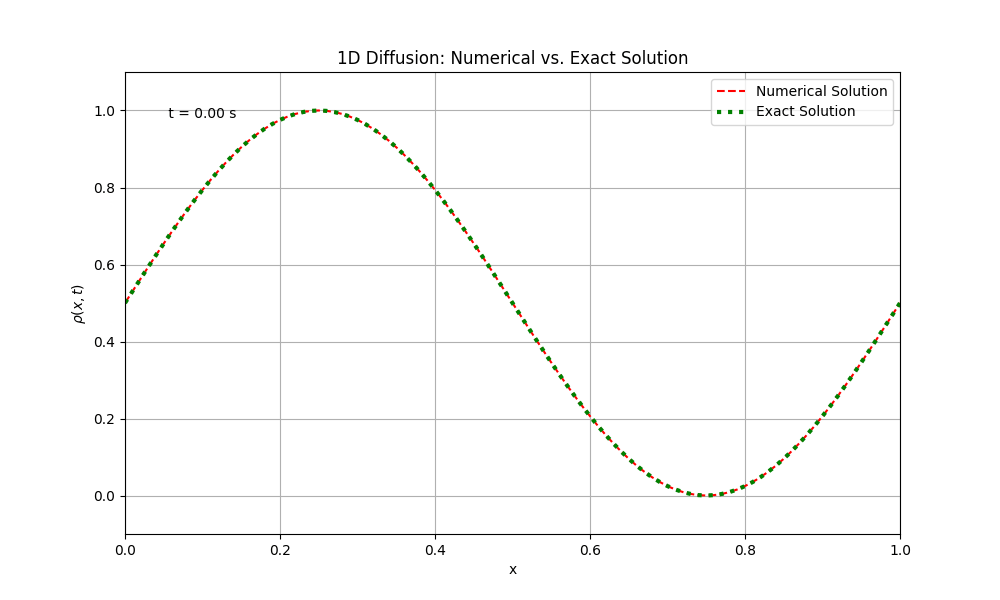

<!-- _class: lead -->
# RJ-net: Reaction-Jacobian Network

**反應-擴散-對流系統的物理神經網路求解器**

*基於 PINN (Physics-Informed Neural Network) 方法*

---

## 📋 專案概述

**RJ-net** 是一個基於物理的神經網路（PINN），用於求解反應-擴散-對流系統：

$$\rho_t + \nabla \cdot (\rho u) = \Delta \rho + \sum r_i$$

**測試問題：Fisher-KPP 方程**
$$\rho_t = \Delta \rho + k^+ \rho - k^- \rho^2$$

其中 $k^+ \rho - k^- \rho^2$ 是 logistic 反應項

---

## 🎯 核心方法

RJ-net 使用以下耦合方程組進行時間推進：

1. **密度更新**: $\rho^{n+1} = \frac{\rho_0 + R^{n+1}}{J^{n+1}}$

2. **速度場**: $u^{n+1} = u_{NN}(\rho^n)$

3. **反應率**: $r^{n+1} = r_{NN}(\rho^n)$

4. **反應累積**: $R^{n+1} = R^n + \Delta t \cdot r^n$

5. **Jacobian**: $J^{n+1} = J^n + \Delta t [(\nabla \cdot u)J^n - u \cdot \nabla J]$

---

## ⚙️ 初始設置 - 物理參數

```yaml
physics:
  x_min: 0.0        # 空間範圍起點
  x_max: 1.0        # 空間範圍終點
  t_min: 0.0        # 時間起點
  t_max: 1.0        # 時間終點
  nx: 101           # 空間網格點數
  nt: 101           # 時間步數
  
  # 反應參數 (ρ_t = Δρ + ρ - ρ²)
  k_plus: 1.0       # 線性增長係數
  k_minus: 1.0      # 二次抑制係數
```

**時間步長**: $\Delta t = \frac{t_{max} - t_{min}}{n_t - 1} = 0.01$

---

## ⚙️ 初始設置 - 神經網路架構

```yaml
training:
  learning_rate: 0.001
  epochs: 2000
  hidden_size: 32
  
  # 損失函數權重
  weight_pde: 1.0          # PDE 殘差項
  weight_bc: 1.0           # 邊界條件項
  weight_reaction: 1.0     # 反應項
```

**兩個神經網路**:
- **VelocityNet**: $u_{NN}(x, \rho) \to u$ (3層隱藏層，Tanh激活)
- **ReactionNet**: $r_{NN}(x, \rho) \to r$ (3層隱藏層，Tanh激活)

---

## 📊 初始條件

**初始密度分布**:
$$\rho(x, t=0) = 0.5 \times (1 + \sin(2\pi x))$$

這是一個在 $[0, 1]$ 區間上的正弦波，範圍在 $[0, 1]$ 之間。

**初始 Jacobian**: $J(x, t=0) = 1$

**初始反應累積**: $R(x, t=0) = 0$

---

## 🔄 程式流程圖

```
開始
  ↓
載入配置檔 (config.yaml)
  ↓
初始化神經網路 (VelocityNet, ReactionNet)
  ↓
建立空間網格與時間步
  ↓
訓練迴圈 (2000 epochs) ────┐
  ├─ 時間推進 (101步)      │
  │   ├─ 預測 u & r        │
  │   ├─ 更新 R, J         │
  │   ├─ 計算新密度 ρ       │
  │   └─ 計算損失           │
  ├─ 反向傳播              │
  └─ 更新網路參數 ──────────┘
  ↓
評估模式：生成完整時間序列
  ↓
視覺化與分析
  ↓
儲存結果
```

---

## 📐 損失函數設計

**總損失函數**:
$$L_{total} = w_{PDE} \cdot L_{PDE} + w_{BC} \cdot L_{BC} + w_{reaction} \cdot L_{reaction}$$

1. **PDE 殘差損失**:
   $$L_{PDE} = \sum_{n=0}^{N_t-1} \left\| \frac{\rho^{n+1} - \rho^n}{\Delta t} - \frac{\partial^2 \rho}{\partial x^2} - r_{exact}(\rho) \right\|^2$$

2. **邊界條件損失** (Neumann BC: $\frac{\partial \rho}{\partial x} = 0$):
   $$L_{BC} = \left|\frac{\partial \rho}{\partial x}\right|_{x=0}^2 + \left|\frac{\partial \rho}{\partial x}\right|_{x=1}^2$$

3. **反應項損失**:
   $$L_{reaction} = \|r_{NN}(\rho) - r_{exact}(\rho)\|^2$$

---

## 📊 訓練結果 - 損失收斂



損失函數在訓練過程中穩定下降，顯示模型成功學習物理規律。

---

## 🎬 時間演化動畫



完整時間演化過程，展示密度場從初始條件逐步演化到最終穩態。

---

## ✅ 關鍵成果

1. **準確性**: 數值解與精確解高度吻合
2. **收斂性**: 損失函數穩定下降
3. **物理一致性**: 
   - 反應項學習準確
   - 質量基本守恆
   - 滿足邊界條件
4. **穩定性**: 時間推進過程穩定

**質量守恆檢驗**:
- $M(0) \approx M(T)$
- 相對變化 < 1%

---

## 🔬 技術特點

### 優勢
- ✅ 無需傳統有限差分/有限元網格
- ✅ 自動微分計算梯度，精確且高效
- ✅ 物理約束嵌入損失函數
- ✅ 可擴展至複雜幾何和高維問題

### 應用場景
- 反應-擴散系統（化學反應、生態模型）
- 流體力學（對流-擴散方程）
- 熱傳導與物質輸運
- 生物醫學（腫瘤生長模型）

---

## 📁 輸出檔案結構

```
results/run_20251016_111142/
├── config_used.yaml      # 使用的配置參數
├── loss.png              # 訓練損失演化圖
├── comparison.png        # 初始vs最終狀態比較
├── analysis.png          # 詳細分析（速度、反應、質量）
└── animation.gif         # 時間演化動畫
```

所有結果自動保存，便於後續分析和報告。

---

## 🚀 未來改進方向

1. **多維擴展**: 擴展至2D/3D空間
2. **複雜反應**: 引入多組分反應系統
3. **自適應網格**: 動態調整空間解析度
4. **不確定性量化**: 引入貝葉斯神經網路
5. **加速訓練**: 使用更大的網路和GPU並行
6. **實驗數據整合**: 結合實驗觀測數據進行訓練

---

<!-- _class: lead -->
# 感謝聆聽！

## Questions?

**GitHub Repository**: RJ-net
**Contact**: nthu114026511

*基於物理的深度學習 · 科學計算的未來*

